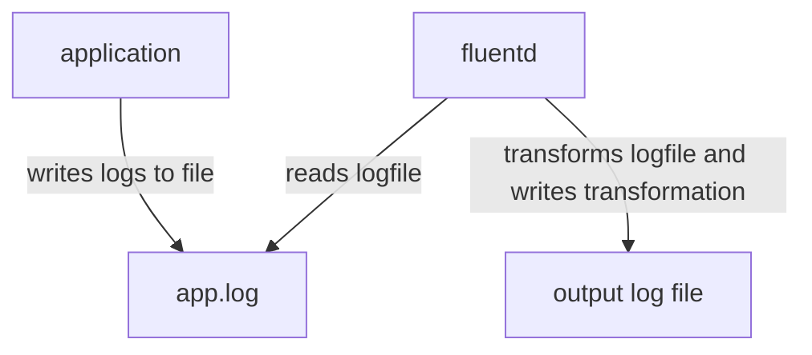

# Fluentd

## Part 1: Writing logs to a file

### Overview



In this example we have an application that writes logs to a file called `app.log` every five seconds. 
Here's `app/app.sh`:
```bash
#!/bin/sh
while true
do
  echo "Writing log to a file"
  echo '{"info":"an example log message"}' >> /app/app.log
  sleep 5
done
```

The fluentd container has access to this log file. In the volumes section for the `fluentd` service in `docker-compose.yml`, we see `./app:/fluentd/log/files/`. So the `./app` file is mounted to `/fluentd/log/files/` in the fluentd container. 

Fluentd reads this log file, transforms the logs, and then writes them to files in its output folder. In this example the fluentd output folder is mounted to our output folder.

### Fluentd config

The whole `config` folder is mounted to `/fluentd/etc/` which is where the configuration needs to live in the fluentd container. Fluentd's configuration is in the file `config/fluent.conf`. There are three blocks: `source`, `filter`, and `match`. `source` describes how to read a given set of logs. `filter` describes how to alter a set of logs. `match` describes what to do with a set of logs. 

The `config/fluent.conf` file is fully commented so look in there to get a line-by-line description of whats happening.

### Running the demo

In this directory, in one terminal run `docker-compose up`. In another terminal, look at the contents of the output folder. You should see a new folder called `tranformed_app.log` with buffer files inside. Look at what's in the buffer file. You should see something like:

```
2023-08-22T15:30:26+00:00       a-string-to-match-on    {"info":"an example log message","host_param":"d2839a7788a5"}
```

This is how fluentd is tranforming the original log output that's in `app/app.log`. 
