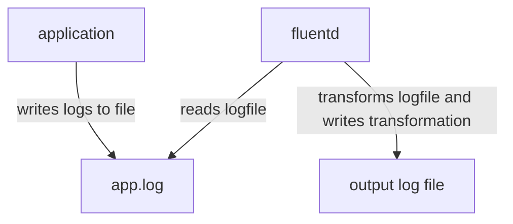

# Fluentd

## Part 1: Writing logs to a file

### Diagram of this workflow

```mermaid
flowchart TD
app[application]
logfile[app.log]
fluentd[fluentd]
output[output log file]

app -->|writes logs to file| logfile
fluentd -->|reads logfile| logfile
fluentd -->|transforms logfile and writes transformation| output

```
