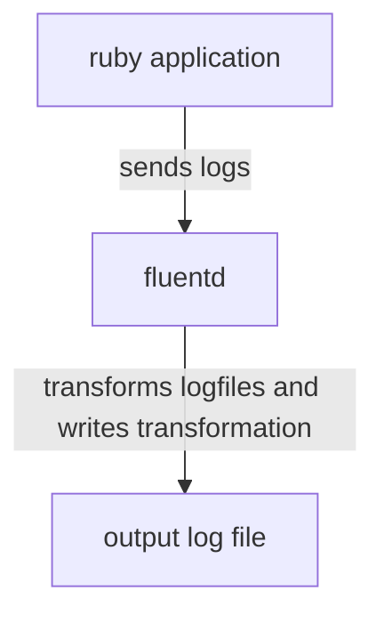

# Fluentd

## Part 2: Ruby app sends logs to fluentd directly 

### Overview



In this second example we have a tiny ruby application that sends logs to
fluentd every 5 seconds. 
Here's `app/app.rb`:
```ruby
require 'fluent-logger'

# configure the fluent logger. The host is the fluentd service. The port is the
# default port fluentd listens on. It's also set in fluent.conf
log = Fluent::Logger::FluentLogger.new(nil, :host => 'fluentd', :port => 24224)

#so the puts line shows as its run
$stdout.sync = true

while true do
 puts "logging some info"
 
 # "ruby-app" is the tag.
 log.post("ruby-app", {"info" => "a more different log message" })

 sleep 5
end
```

### Fluentd config

Once again, the configuration is in `config/fluent.conf` which is properly
mounted in the fluentd container. 

This time we're using the input plugin "forward" which is the one to use when
receiving logs via the fluent plugin. 

The match block matches all logs this time, not just ones that match a given
tag. This is for simplicity. You can still match on the tag. The block is still
writing to the folder `output/transformed_app.log`

### Running the demo

In this directory, in one terminal run `docker-compose up`. In another terminal,
look at the contents of the output folder. You should see a new folder called
`tranformed_app.log` with buffer files inside. Look at what's in the buffer
file. You should see something like:

```
2023-08-22T17:37:45+00:00       ruby-app        {"info":"a more different log message"}
```
