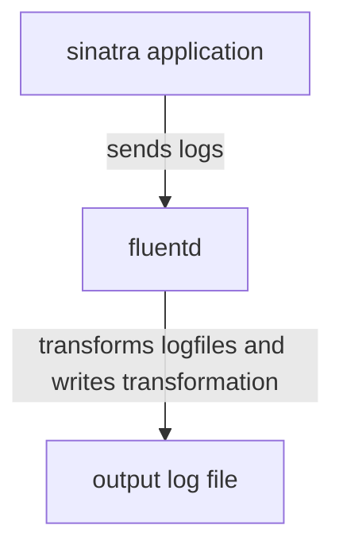

# Fluentd

## Part 3: Sinatra app sends logs to fluentd directly 

### Overview



In this third example we have a Sinatra application that has the following routes:
```
get "/"
get "/hello"
get "/error"

```

`get /` prints the message "Hello World" and has a link to the `/hello` route.
It also logs an info message.

`get /hello"` just prints "Hello again". 

`get /error"` raises an error

There are two loggers configured: one for application logging in `app.rb`, the
other for request logging in `config.ru`. 

#### `app.rb` loggers
The one in `app.rb` uses the `LevelFluentLogger` which has the same interface as
`Logger`. 

The `ErrorLogger` class wraps the logger and adds the method `#puts` so that
error messages are proprely recorded.

Then there's making sinatra use the error logger for logging errors. 

#### `config.ru` loggers

In `config.ru` we have the class `MyLoggerMiddleware` which is a replacement for
`Rack::CommonLogger` that generates logs that look like Apache2 Combined Logs in
a structured format. 

If we start using this, we'll turn it into a gem and call it something better
than `MyLoggerMiddleware`, but for the purposes of this demo it's fine. 

The main thing is that this is using the `FluentLogger` and posts the request
logs to fluentd.

### Fluentd config

The fluentd config is identical to Part 2. 

### Running the demo

In this directory, in one terminal run `docker-compose up`. 


In another terminal, `tail -f` the `output/transformed_app.log/buffer.*.log`
file. 

Open a browser and go to `localhost:4567`. Then try `localhost:4567/hello`, Then
try `localhost:4567/error`

You should see output that looks like:

```
2023-08-25T20:33:31+00:00	my-ruby-sinatra-application.info	{"level":"INFO","message":"This is an info message"}
2023-08-25T20:33:31+00:00	my-ruby-sinatra-application.rack-traffic-log	{"time":"1692995611 (25/Aug/2023:20:33:31 +0000)","record":{"user":null,"method":"GET","code":"200","size":"46","host":"192.168.128.1","path":"/","query":"","referer":null,"agent":"Mozilla/5.0 (X11; Ubuntu; Linux x86_64; rv:109.0) Gecko/20100101 Firefox/116.0"},"response_time":0.0007125169977371115}
2023-08-25T20:33:34+00:00	my-ruby-sinatra-application.rack-traffic-log	{"time":"1692995614 (25/Aug/2023:20:33:34 +0000)","record":{"user":null,"method":"GET","code":"200","size":"11","host":"192.168.128.1","path":"/hello","query":"","referer":"http://localhost:4567/","agent":"Mozilla/5.0 (X11; Ubuntu; Linux x86_64; rv:109.0) Gecko/20100101 Firefox/116.0"},"response_time":0.00042476099770283327}
2023-08-25T20:33:37+00:00	my-ruby-sinatra-application.error	{"level":"ERROR","message":"2023-08-25 20:33:37 - StandardError - some message:\n\t/app/app.rb:36:in `block in <top (required)>'\n\t/gems/ruby/3.2.0/gems/sinatra-3.1.0/lib/sinatra/base.rb:1763:in `call'\n\t/gems/ruby/3.2.0/gems/sinatra-3.1.0/lib/sinatra/base.rb:1763:in `block in compile!'\n\t/gems/ruby/3.2.0/gems/sinatra-3.1.0/lib/sinatra/base.rb:1066:in `block (3 levels) in route!'\n\t/gems/ruby/3.2.0/gems/sinatra-3.1.0/lib/sinatra/base.rb:1084:in `route_eval'\n\t/gems/ruby/3.2.0/gems/sinatra-3.1.0/lib/sinatra/base.rb:1066:in `block (2 levels) in route!'\n\t/gems/ruby/3.2.0/gems/sinatra-3.1.0/lib/sinatra/base.rb:1115:in `block in process_route'\n\t/gems/ruby/3.2.0/gems/sinatra-3.1.0/lib/sinatra/base.rb:1113:in `catch'\n\t/gems/ruby/3.2.0/gems/sinatra-3.1.0/lib/sinatra/base.rb:1113:in `process_route'\n\t/gems/ruby/3.2.0/gems/sinatra-3.1.0/lib/sinatra/base.rb:1064:in `block in route!'\n\t/gems/ruby/3.2.0/gems/sinatra-3.1.0/lib/sinatra/base.rb:1061:in `each'\n\t/gems/ruby/3.2.0/gems/sinatra-3.1.0/lib/sinatra/base.rb:1061:in `route!'\n\t/gems/ruby/3.2.0/gems/sinatra-3.1.0/lib/sinatra/base.rb:1185:in `block in dispatch!'\n\t/gems/ruby/3.2.0/gems/sinatra-3.1.0/lib/sinatra/base.rb:1156:in `catch'\n\t/gems/ruby/3.2.0/gems/sinatra-3.1.0/lib/sinatra/base.rb:1156:in `invoke'\n\t/gems/ruby/3.2.0/gems/sinatra-3.1.0/lib/sinatra/base.rb:1180:in `dispatch!'\n\t/gems/ruby/3.2.0/gems/sinatra-3.1.0/lib/sinatra/base.rb:996:in `block in call!'\n\t/gems/ruby/3.2.0/gems/sinatra-3.1.0/lib/sinatra/base.rb:1156:in `catch'\n\t/gems/ruby/3.2.0/gems/sinatra-3.1.0/lib/sinatra/base.rb:1156:in `invoke'\n\t/gems/ruby/3.2.0/gems/sinatra-3.1.0/lib/sinatra/base.rb:996:in `call!'\n\t/gems/ruby/3.2.0/gems/sinatra-3.1.0/lib/sinatra/base.rb:985:in `call'\n\t/gems/ruby/3.2.0/gems/rack-protection-3.1.0/lib/rack/protection/xss_header.rb:20:in `call'\n\t/gems/ruby/3.2.0/gems/rack-protection-3.1.0/lib/rack/protection/path_traversal.rb:18:in `call'\n\t/gems/ruby/3.2.0/gems/rack-protection-3.1.0/lib/rack/protection/json_csrf.rb:28:in `call'\n\t/gems/ruby/3.2.0/gems/rack-protection-3.1.0/lib/rack/protection/base.rb:53:in `call'\n\t/gems/ruby/3.2.0/gems/rack-protection-3.1.0/lib/rack/protection/base.rb:53:in `call'\n\t/gems/ruby/3.2.0/gems/rack-protection-3.1.0/lib/rack/protection/frame_options.rb:33:in `call'\n\t/gems/ruby/3.2.0/gems/rack-2.2.8/lib/rack/logger.rb:17:in `call'\n\t/gems/ruby/3.2.0/gems/sinatra-3.1.0/lib/sinatra/base.rb:254:in `call'\n\t/gems/ruby/3.2.0/gems/rack-2.2.8/lib/rack/head.rb:12:in `call'\n\t/gems/ruby/3.2.0/gems/rack-2.2.8/lib/rack/method_override.rb:24:in `call'\n\t/gems/ruby/3.2.0/gems/sinatra-3.1.0/lib/sinatra/base.rb:219:in `call'\n\t/gems/ruby/3.2.0/gems/sinatra-3.1.0/lib/sinatra/base.rb:2074:in `call'\n\t/gems/ruby/3.2.0/gems/sinatra-3.1.0/lib/sinatra/base.rb:1633:in `block in call'\n\t/gems/ruby/3.2.0/gems/sinatra-3.1.0/lib/sinatra/base.rb:1849:in `synchronize'\n\t/gems/ruby/3.2.0/gems/sinatra-3.1.0/lib/sinatra/base.rb:1633:in `call'\n\t/app/config.ru:34:in `call'\n\t/gems/ruby/3.2.0/gems/rack-2.2.8/lib/rack/tempfile_reaper.rb:15:in `call'\n\t/gems/ruby/3.2.0/gems/rack-2.2.8/lib/rack/lint.rb:50:in `_call'\n\t/gems/ruby/3.2.0/gems/rack-2.2.8/lib/rack/lint.rb:38:in `call'\n\t/gems/ruby/3.2.0/gems/rack-2.2.8/lib/rack/show_exceptions.rb:23:in `call'\n\t/gems/ruby/3.2.0/gems/rack-2.2.8/lib/rack/common_logger.rb:38:in `call'\n\t/gems/ruby/3.2.0/gems/sinatra-3.1.0/lib/sinatra/base.rb:261:in `call'\n\t/gems/ruby/3.2.0/gems/rack-2.2.8/lib/rack/content_length.rb:17:in `call'\n\t/gems/ruby/3.2.0/gems/rack-2.2.8/lib/rack/handler/webrick.rb:95:in `service'\n\t/gems/ruby/3.2.0/gems/webrick-1.8.1/lib/webrick/httpserver.rb:140:in `service'\n\t/gems/ruby/3.2.0/gems/webrick-1.8.1/lib/webrick/httpserver.rb:96:in `run'\n\t/gems/ruby/3.2.0/gems/webrick-1.8.1/lib/webrick/server.rb:310:in `block in start_thread'"}
2023-08-25T20:33:37+00:00	my-ruby-sinatra-application.rack-traffic-log	{"time":"1692995617 (25/Aug/2023:20:33:37 +0000)","record":{"user":null,"method":"GET","code":"500","size":"30","host":"192.168.128.1","path":"/error","query":"","referer":null,"agent":"Mozilla/5.0 (X11; Ubuntu; Linux x86_64; rv:109.0) Gecko/20100101 Firefox/116.0"},"response_time":0.0005923860007897019}
```
