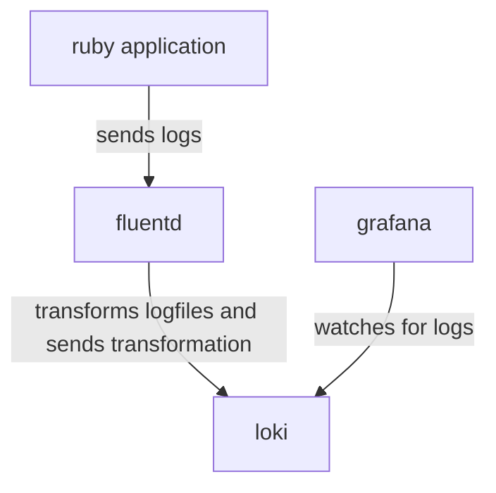

# Fluentd

## Part 3: Ruby app sends logs to fluentd and then on to loki and grafana

### Overview

In this 4th example we're back to our simple ruby application because our focus
is on getting our logs from a ruby application to loki and visualized in
grafana. 

### Fluentd Dockerfile
In the root of this directory is a `Dockerfile`. It adds the
`fluent-plugin-grafana-loki` plugin to the fluent image. 

### Fluentd config

Once again, the configuration is in `config/fluent.conf` which is properly
mounted in the fluentd container. 

The source block is the same as part 2. 

The match block is of type `loki` and adds a label to the logs before sending. 
Documentation: https://grafana.com/docs/loki/latest/clients/fluentd/ 

### Grafana config
In the `docker-compose.yaml` file we mount the `loki_datasource.yaml` to 
`/etc/grafana/provisioning/datasources/loki_datasource.yaml`. This means grafana
will start with the loki datasource already hooked up.
 
### Running the demo

In this directory, in one terminal run `docker-compose up`. 

In the browser go to `http://localhost:3000/explore`. Login in username: `admin`;
password `admin`. Choose the datasource "Loki". Then enter the query
`{job="ruby"}`. Press "Run Query" at the top. You should see some logs!
